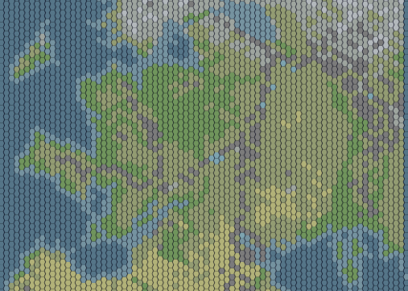
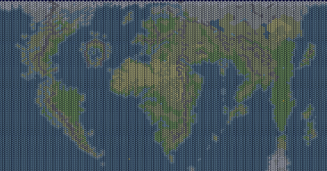

# Unciv Warhammer

## WORK IN PROGRESS

An attempt to create a full mod (rulesets, map, graphics) of Warhammer for unciv.
Modmod of Fantasia mixed with previous Civ3/Civ4 Warhammer extensions materials.

### Maps
* Old World

* Warhammer world

### Nations 
Available:
* Reikland (The Empire)
* Bretonnia
* Kislev
* Sylvania
* Dwarfs
* Khemri
* Araby
* Estalia
* Tilea
* Loren
* Norsca
* Albion
* Ulthuan
* Naggaroth
* Skaven
* Chaos Dwarfs
* Ironclaw Orcs
* Ogre Kingdoms
* Badmoon Goblins
* Beastmen
* Hordes of Chaos
* Kurgan
* Ind
* Cathay
* Nippon
* Amazons
* Lustria

City states
* Marienburg
* The Moot
* Lahmia
* Dolgan

Planned:
* Border Princes
* Ungols
* Hung

### Religions
* The Old Ones
* Cult of Sigmar
* Lady of the Lake
* Elven Gods
* Ancestor Gods
* Gork and Mork
* Cult of the Horned Rat
* Chaos Gods

### Technologies
Common tech tree (eras)
#### Ancient age
[//]: # (col 1)
* Rise of Sigmar (Starting Tech)
Nations unique techs (Ancient era)
* Old World (Reikland, Kislev, Tilea, Estalia)
* Knightly Virtues (Bretonnia)
* Channeling (Albion, Ulthuan)
* Dwarven Ingenuity (Dwarfs, Chaos Dwarfs)
* Forest Mastery (Loren). Allows Loren Magic (with Raw Magic)
* Norse Tradition (Norsca)
* Arabyan Tradition (Araby, Ind)
* Far East (Cathay, Nippon)
* Undead Curse (Sylvania, Khemri)
* Underworld (Skaven)
* Swamp-dwelling (Slann, Amazons)
* Greenskin
* Chaos

[//]: # (col 2)
* Agriculture. Allows Granary.
* Hunting. Allows Hunting Lodge.
* Fishing
* Mysticism. Allows Waystone, Old Ones Shrine (with Swamp-Dwelling).

* WAAGH!: free tech for Greenskin. 
* Insatiable Hunger: free tech for Ogre Kingdoms

[//]: # (col 3)
* Brewing: requires Agriculture. Allows Tavern, Bugman's Brewery.
* Calendar: requires Agriculture
* Crafting: requires Agriculture or Dwarven Ingenuity. Allows Market, Tailor.
* Animal Husbandry: requires Agriculture, Hunting. Allows Tanner.

* Herblore (Herbalism): requires Hunting. Allows Herbalist.
* Archery: requires Hunting. Allows Archery Range.
* Warrior Code: requires Hunting. Allows Barracks, Training Yard, Destruction Shrine (with WAAGH!), Heroic Epic.

* Chronicles: requires Mysticism. Allows Elder Council, The Great Book of Grudges (with Dwarven Ingenuity).
* Contemplation: requires Mysticism. Allows Elven Shrine (with Elven Gods).
* Ceremonial Burial: requires Mysticism. Allows Graveyard, Immortality Shrine (with Undead Curse).
* Raw Magic: requires Mysticism. Allows Coven.

[//]: # (col 4)
* Astrology: requires Calendar

* Roads: requires Crafting
* Masonry: requires Crafting. Allows Walls.
* Trade: requires Crafting. Allows Inn, The Great Bazaar.
* Mining: requires Crafting

* Horseback Riding: requires Animal Husbandry. Allows Stable, Silk Road, Spice Road (with Market and Trade)
* Tracking: requires Herblore, Animal Husbandry

* Festivals: requires Chronicles. Allows Circus.

* Philosophy: requires Contemplation, Chronicles. Allows Spirituality Shrine (with Knightly Virtues)
* Necromancy: requires Ceremonial Burial, Raw Magic. Allows Black Pyramid.

* Loren Magic: requires Forest Mastery, Raw Magic. Allows Tower of Eternal Wood.
* Magic of the Horned Rat: requires Underworld, Raw Magic

[//]: # (col 5)
* Mathematics: requires Calendar, Masonry. Allows Siege Workshop.
* Sailing: requires Fishing, Trade. Allows Harbor, Lighthouse (with Construction), The Great Voyage (with Norse Tradition).

* Bronze Working: requires Mining. Allows Forge, Dark Forge (with Chaos and Dwarven Ingenuity), The Gates of Zharr.

* Nature Lore: requires Tracking, Archery
* Monster Taming: requires Horseback Riding, Tracking

[//]: # (col 6)
* Construction: requires Masonry, Bronze Working, Mathematics. Allows City Walls, The Great Bastion.
* Metal Casting: requires Bronze Working
* Warfare: requires Warrior Code, Bronze Working. Allows Wheelwright (with Crafting).

* Elemental Magic: requires Raw Magic, Nature Lore. Allows Palace of the Wizard Calife.

[//]: # (col 7)
* Irrigation: requires Construction
* Sanitation: requires Construction. Allows Aqueduct, Sewer, The Floating Gardens of Lost Xholankha (with Irrigation), The Underways (with Underworld).

* Alchemy: requires Herblore, Metal Casting. Allows Alchemist's Lab, Philosopher's Stone.

* Iron Working: requires Metal Casting, Warfare

* Tyranny: requires Warfare. Allows Dungeon, Gallows, Tarnhelm's Keep.
* Lordship: requires Warfare. Allows Monument, Castle, Governor's Manor.

[//]: # (col 8)
* Stirrups: requires Iron Working, Horseback Riding
* Currency: requires Trade, Metal Casting, Lordship.
* Feudalism: requires Lordship or Tyranny

#### Age of Magic
[//]: # (col 1)
* Bloodbowl: requires Trade, Brewing. Allows Bloodbowl Stadium (with Construction), Bloodweiser Stadium.

* Civil Service: requires Currency. Allows Courthouse, The Spy Network.
* Mercenary Contracts: requires Currency. Allows Fighters' Guild.
* Chivalry: requires Feudalism, Stirrups

* Monster Breeding: requires Monster Taming, Alchemy, Stirrups. Allows Breeding Pit.
 
* Smithing: requires Iron Working. Allows Mastersmith, Forge of Vaul.
* Gromril Smithing: requires Iron Working, Dwarven Ingenuity

* Priesthood: requires Philosophy, Festivals, Ceremonial Burial. Allows Temple, The Sisters of Shallya (with Old World).
* Words of Salvation: requires Philosophy, Warrior Code. Allows Salvation Shrine.

* High Magic: requires Raw Magic, Channeling. Allows White Tower.
* True Dhar: requires Raw Magic, Chaos. Allows Dark Convenant.
* Corruption of Chaos: requires Philosophy, Raw Magic. Allows Chaos Shrine (with Chaos).

* Rune Smithing: requires Ancestor Gods, Gromril Smithing. Allows Runeforge.

* Master of the Winds: requires Elemental Magic
* Master of the Earth: requires Elemental Magic
* Master of Water: requires Elemental Magic
* Master of Fire: requires Elemental Magic
* Master of Ice: requires Elemental Magic

#### Age of Lore
[//]: # (col 2)
* Imperial roads: requires Roads, Construction, Civil Service
* Guilds: requires Civil Service, Feudalism, Currency

* Knightly Orders: requires Chivalry. Allows The Knights Panther, The Order of the White Wolf, The Order of the Fiery Heart, The Brotherhood of the Bear.
* Grail Quest: requires Chivalry, Knightly Virtues. Allows Shrine of the Holy Grail.

* Tournaments: requires Smithing, Chivalry. Allows Joust Arena (with Knightly Virtues).
* MoTileaticism: requires Priesthood. Allows MoTileatery.

* Meteoric Iron: requires Smithing

* Monster Bonding: requires Monster Breeding, Nature Lore

* Fanaticism: requires Priesthood, Tyranny. Allows Tribunal, Inquisition, The Cauldron of a Thousand Poxes (with Underworld).

* Literature: requires Priesthood. Allows Library, The Black Library.

* Winds of Magic: requires Philosophy, Raw Magic, True Dhar, High Magic, Loren Magic

* Bloodlust of Khorne: requires Chaos, Corruption of Chaos. Allows The Cave of Skulls.
* Slaanesh's Pleasures: requires Chaos, Corruption of Chaos. Allows The Six Circles of Seduction.
* Gifts of the Plagued One: requires Chaos, Corruption of Chaos. Allows Grandfathers' Embrace.
* Lore of Change: requires Chaos, Corruption of Chaos. Allows The Temple of Many Colors (with Priesthood).

[//]: # (col 3)
* Lore of Fire: requires Warfare, Winds of Magic. Allows The Bright Order.
* Lore of Life: requires Nature Lore, Winds of Magic. Allows The Jade College.
* Lore of Lights: requires Mathematics, Winds of Magic. Allows The Order of Light.
* Lore of Heavens: requires Astrology, Winds of Magic. Allows The Celestial College
* Lore of Metals: requires Metal Casting, Winds of Magic. Allows The Golden Order.
* Lore of Shadows: requires Civil Service, Winds of Magic. Allows The Grey Order.
* Lore of Beasts: requires Monster Taming, Winds of Magic. Allows The Amber Brotherhood.
* Lore of Death: requires Ceremonial Burial, Winds of Magic. Allows The Amethyst Order.

* Chaos Incursion: requires Bloodlust of Khorne, Slaanesh's Pleasures, Gifts of the Plagued One, Lore of Change. Allows Cauldron of Blood.

#### Medieval
[//]: # (col 1)
* Invention: requires Construction, Iron Working. Allows Bowyer (with Archery Range), Gnomes' Workshop.
* Military Tradition: requires Tournaments, Festivals. Allows Military Academy, The War Academy.
* Navigation: requires Sailing, Astrology. Allows Shipyard, Glittering Tower Lighthouse.
* Education: requires Literature, Mathematics. Allows University (with Library)

* The End Times: requires Chaos Incursion. Allows Lord of the End Times.

[//]: # (col 2)
* Machinery: requires Invention
* Astronomy: requires Navigation. Allows Observatory

[//]: # (col 3)
* Engineering: requires Machinery. Allows High Walls, Citadel.

* Banking: requires Guilds. Allows Bank.

#### Renaissance
[//]: # (col 1)
* Gunpowder: requires Invention, Alchemy
* Advanced Engineering: requires Engineering
* Economics: requires Banking, Education

[//]: # (col 2)
* Steel: requires Advanced Engineering, Smithing. Allows Drydock, Great Forge.
* Cannons: requires Gunpowder. Allows Cannon Forge (with Siege Workshop).
* Flight: requires Advanced Engineering
* Steam Power: requires Advanced Engineering

[//]: # (col 3)
* Rifling: requires Cannons, Steel

### Credits and inspirations
* [Unciv Fantasia mod](https://github.com/amfauzn/Fantasia), thanks to [amfauzn](https://github.com/amfauzn) and contributors
* Civ3's [Warhammer 2.5 ](https://forums.civfanatics.com/resources/warhammer-fantasy-mod-2-5.3833/) extension
* Civ4's [Warhammer Fantasy Battle](https://forums.civfanatics.com/threads/warhammer-conversion-beta-download-debug-thread.247207/)